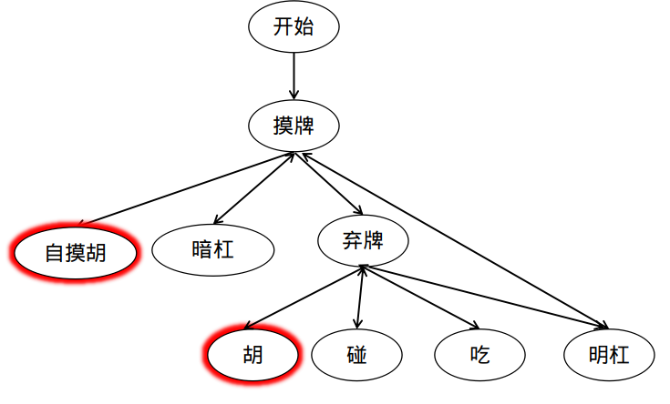

# 本程序的麻将规则
* 不考虑花牌：总共只有34种牌，每种牌都是4张，总共136张牌。  
分别是：东西南北中发白+万筒条各9个。  
* 不考虑鬼牌
* 不考虑叫听，可以直接胡牌
* 不考虑多局游戏，只考虑一局游戏。不考虑积分制，不计算番数，只看一局游戏的输赢。  
* 不考虑特殊牌型胡牌，不考虑七对十三幺。

# 麻将程序相关组件
* 麻将游戏调度：用于各种AI的PK，充当裁判，负责调度各种AI。  
* 麻将AI：提供接口用于和麻将游戏调度器进行通信。    
* 多局游戏：为每个用户记录分数，把在场的全部用户弄成负分则多局游戏结束。如何制定合理的段位制度？如何在多局比赛中评估用户的竞技水平。区分选手的竞技水平都不可能只靠一局。   

# 麻将调度的设计
麻将调度器负责调用AI的各种接口，充当裁判。  
调度器与AI之间的通信有两类机制：
* 无状态AI：调度器需要把当前局面告诉AI，AI是无状态的，AI只起到决策的作用。对于无状态AI，调度器必须保证AI无法篡改游戏数据。最简单的方式就是把游戏状态的副本数据传给AI。  
* 有状态AI：调度器只需要增量告诉AI发生的事情，不需要把全部状态告诉AI。有状态AI能够减少与调度器之间的数据传输量。    

不管是有状态AI还是无状态AI，调度器都需要对AI的回复进行校验。防止AI作弊。AI是完全信任调度器的，AI不需要对调度器传来的数据进行校验。调度器是完全不信任AI的，调度器需要对AI传来的数据进行校验。      
对于计算机博弈类的问题，调度器与AI之间的通信类型较少，只有一种：让AI决定着法。而扑克，麻将这类游戏调度器与AI之间通信类型很多，如麻将的吃，碰，弃牌等。对于通信类型较少的游戏，使用无状态AI即可;对于通信类型较多的游戏，使用有状态AI更好。  
游戏状态的描述决定了AI是有状态还是无状态。棋类游戏的游戏状态很容易描述，并且无需关心操作历史。牌类游戏的游戏状态也容易描述，但是牌类游戏跟操作历史也有关系。  
综上，棋类游戏适合使用无状态AI，牌类游戏适合使用有状态AI。

# 基于事件机制的游戏调度器

事件机制是解耦的重要手段。  
调度器是不信任AI的，需要防止AI冒充。所以调度器调用AI时，带上一个token，当AI回复时，只有拥有token的AI才是调度器信任的AI。调度器调用AI时，给不同AI发的token是不一样的。  

# judge函数
评价一个局面的分数，它是一个贪心的抉择。任何一个judge函数都可以通过search算子来加成，使得judge更加精确。  
麻将有多种胡牌方法，从牌堆中摸牌，努力使自己的牌形成胡牌的局面。这个过程等价于无放回摸球问题：一个口袋中有各种球若干，从中随机取球，一直到所取到的球满足某种球型为止，期望摸球次数就是当前局面到胡牌局面的距离。  

# 麻将与大库检索
麻将需要搜索胡牌局面，给定一个手牌牌型，求与之最相近的胡牌局面。距离使用1范数距离。  
大库检索是Judger必备的一个组件。  

麻将可以分成10个区域，每个区域互相独立。利用子空间聚类，高维空间中与手牌接近的胡牌向量，在各个区域中与手牌也是接近的。然后求子空间的笛卡尔积即可得到很多个紧邻。

检索有三个领域：
* 大库检索：向量检索。
* 文本检索：倒排索引。
* 精确检索：分为判断有无和取值，分别对应set和map。

麻将判断胡牌算法需要用到精确检索，在胡牌表中精确检索。麻将判断局面好坏需要用到大库检索。

# 麻将AI调度器
* 使用领域特定语言，以编程的方式输入。
* 使用可视化操作。

# 开源代码
## 小林聪
作者小林聪是一名日本人。
试玩地址：http://kobalab.net/majiang/
repo：https://github.com/kobalab/Majiang

## OpenMajiang
https://github.com/zuoge85/OpenMajiang

## cocos2d商业级麻将
https://github.com/xiyoufang/mahjong

# 参考资料
关于麻将的论文：[Building a computer Mahjong player based on Monte Carlo simulation and opponent models](https://ieeexplore.ieee.org/document/7317929)  
[一种高效的麻将AI算法](https://zhuanlan.zhihu.com/p/53587053)  
[Github:麻将胡牌算法](https://esrrhs.github.io/majiang_algorithm/hu.html) | [Github:麻将AI算法](https://esrrhs.github.io/majiang_algorithm/ai.html) [代码](https://github.com/esrrhs/majiang_algorithm)  
[知乎：人工智能在麻将领域能战胜人类吗？](https://www.zhihu.com/question/40171482)